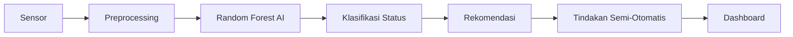

# Grand Design AI Smart Greenhouse Aquaponik

Simulasi end-to-end **Smart Greenhouse Aquaponik ikan nila + selada**
berbasis **Random Forest Classifier** untuk tugas mata kuliah
**Kecerdasan Artifisial**.

Pipeline ini mensimulasikan pembacaan sensor realistis, melakukan labeling
hybrid berbasis domain aquaponik, melatih model AI, membuat visualisasi, dan
menampilkan dashboard interaktif menggunakan Streamlit.

## Alur Sistem



## Sensor yang Disimulasikan

- pH air
- Suhu air
- DO atau dissolved oxygen
- Amonia
- Nitrit
- Nitrat
- EC/TDS
- Level air
- Suhu udara
- Kelembapan udara
- Intensitas cahaya

## Output AI

Model mengklasifikasikan kondisi sistem ke dalam:

- `Normal`
- `DO rendah`
- `Amonia tinggi`
- `Nitrit tinggi`
- `Nutrisi rendah`
- `pH tidak stabil`
- `Level air rendah`
- `Suhu air tinggi`
- `Risiko stres ikan`

## Cara Menjalankan

Install dependensi jika diperlukan:

```powershell
rtk pip install -r requirements.txt
```

Jalankan pipeline:

```powershell
rtk python main.py
```

Semua hasil akan dibuat ulang di folder `outputs/`.

Jalankan dashboard Streamlit:

```powershell
rtk streamlit run app.py
```

Dashboard dapat dibuka di browser pada alamat yang ditampilkan Streamlit,
umumnya `http://localhost:8501`.

## Hasil Utama

- Dashboard Streamlit: `app.py`
- Dataset simulasi 20 hari: `outputs/sensor_dataset.csv`
- Dataset training: `outputs/training_dataset.csv`
- Model Random Forest: `outputs/rf_model.joblib`
- Evaluasi model: `outputs/metrics.json`
- Verifikasi simulasi: `outputs/verification.json`
- Grafik visualisasi: `outputs/plots/`

Dashboard utama menampilkan keputusan AI terbaru, skor risiko, rekomendasi,
tindakan semi-otomatis, aktuator, sensor realtime, ringkasan risiko 20 hari,
dan tab `Data & Verifikasi` untuk melihat history event.

## Visualisasi

Pipeline menghasilkan visual berikut:

- Tren sensor 20 hari
- Ringkasan risiko AI 20 hari
- Status AI terhadap waktu
- Feature importance Random Forest
- Distribusi kelas
- Confusion matrix

Pada dashboard, grafik utama yang ditampilkan adalah ringkasan risiko AI 20
hari. Grafik ini memakai bar untuk risiko maksimum harian dan garis untuk
rata-rata risiko harian agar perubahan warning/critical mudah dibaca.

## Metrik Terakhir

Hasil dari eksekusi terakhir:

- Accuracy: `0.9998`
- Macro F1-score: `0.9983`
- Verifikasi simulasi: `passed`
- Horizon simulasi dashboard: `20 hari`, interval sensor `5 menit`

Tab `Data & Verifikasi` juga menyediakan `History Event`, yaitu rangkuman
kejadian ketika sistem masuk warning/critical atau kelas AI bukan `Normal`.
Setiap event berisi waktu mulai, waktu selesai, durasi, status AI, level
risiko, risk maksimum, tindakan, dan rekomendasi.

## Catatan Realisme Simulasi

Data dummy tidak dibuat acak murni. Generator memasukkan pola aquaponik yang
masuk akal:

- suhu air dan suhu udara naik saat siang,
- intensitas cahaya mengikuti pola pagi-siang-sore,
- DO turun ketika suhu air naik,
- amonia meningkat setelah pemberian pakan,
- nitrit mengikuti proses biologis nitrifikasi,
- nitrat dan EC/TDS berubah lebih lambat,
- level air turun bertahap karena evaporasi dan penggunaan sistem.

Interval data dibuat setiap 5 menit agar terasa seperti pembacaan sensor IoT
realtime, tetapi visualisasi dashboard tetap diringkas agar grafik mudah dibaca.

Labeling dipisahkan menjadi `risk_score`, `risk_level`, dan `final_ai_class`.
Parameter warning menaikkan risiko, sedangkan kelas final baru berubah ketika
kondisi sudah cukup dominan atau mendekati critical.

## Referensi Domain

- Oklahoma State University Extension: prinsip small-scale aquaponics.
- UF/IFAS Extension: kualitas air, DO, amonia, dan nitrit pada sistem ikan.
- FAO: parameter utama monitoring small-scale aquaponic food production.
